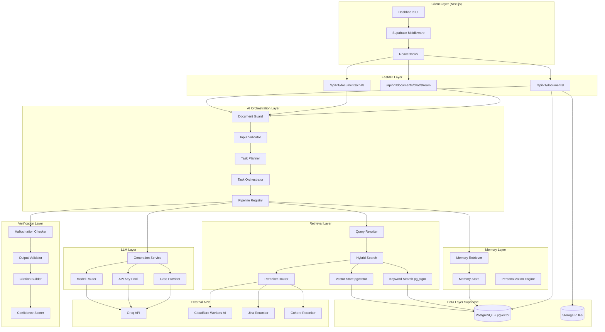
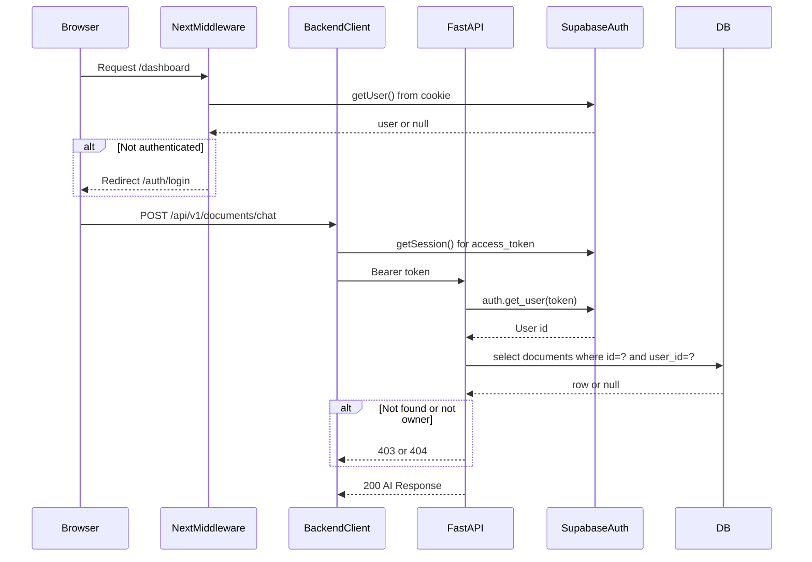
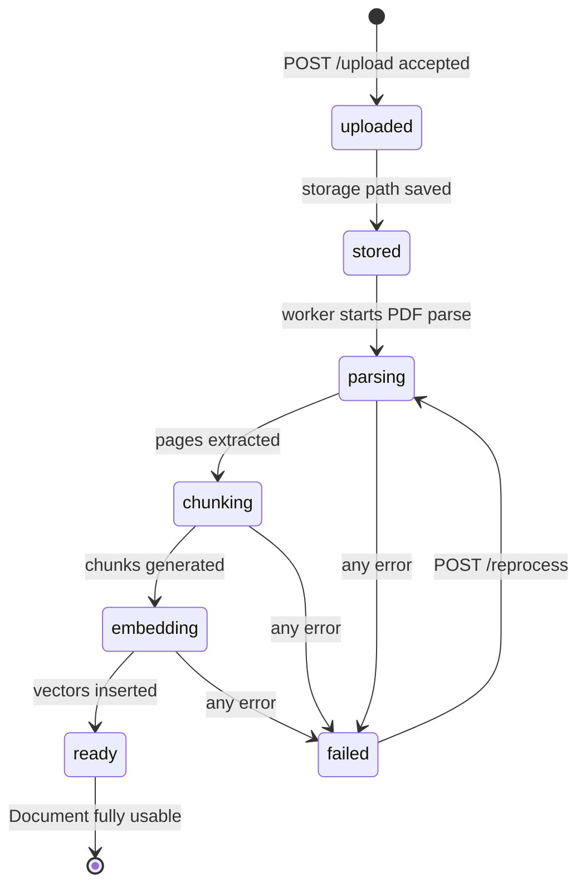
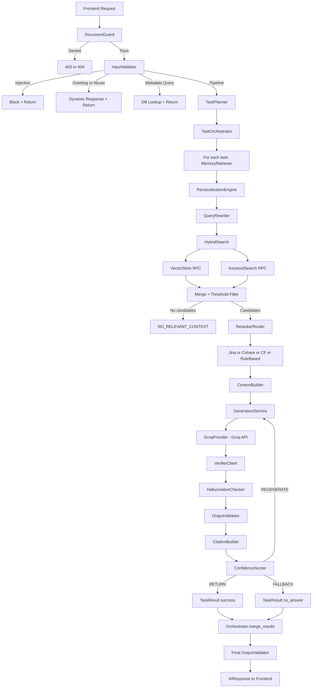
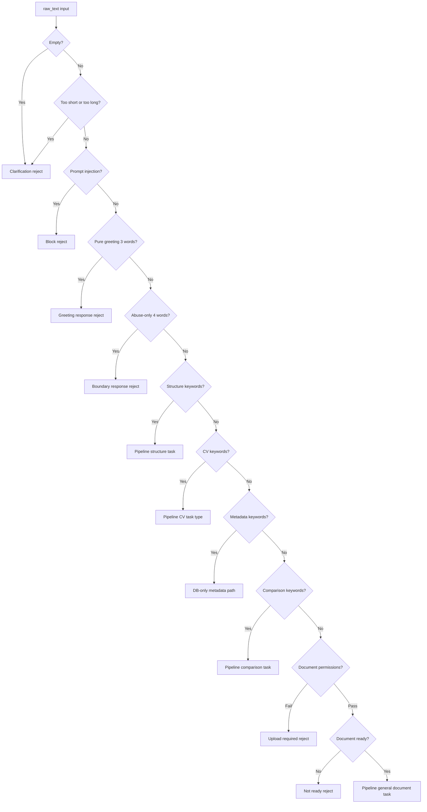
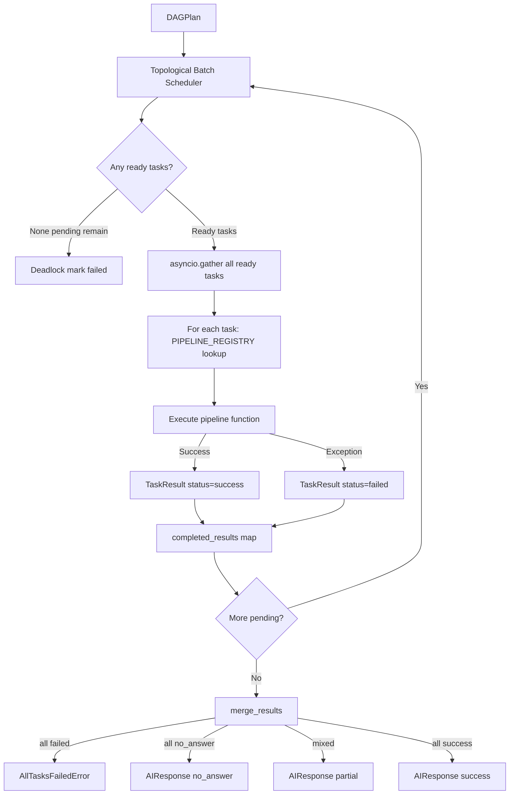
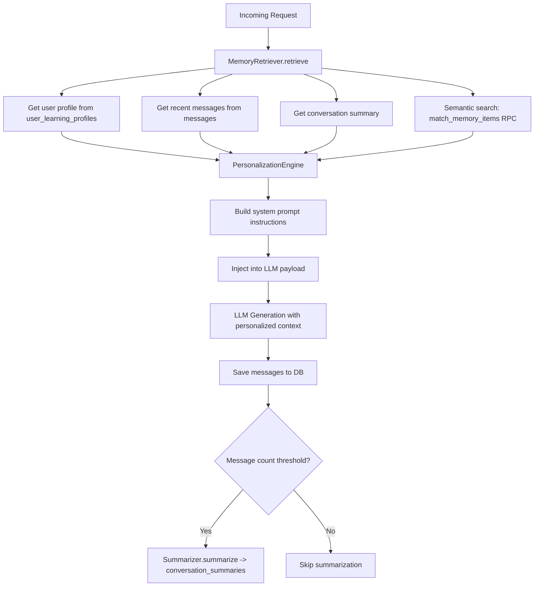
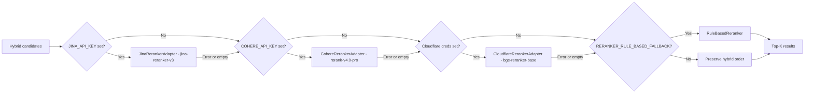
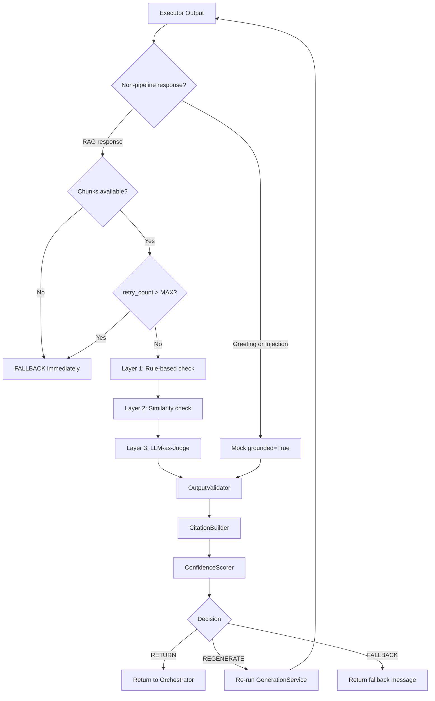

# AI Study Platform — Complete Implementation Documentation

> **Generated from direct source inspection of the NHA-4-094 repository.**
> All statements are backed by code, migrations, or configuration files.
> Evaluation framework excluded per specification.

---

## 1. Executive Summary

The **AI Study Platform** is a full-stack, PDF-grounded educational assistant that enables students to upload PDF documents and interact with their content through conversational AI. The system strictly grounds every response in document evidence — it will not answer questions from general knowledge.

**Core user value:** A student uploads any PDF (textbook, paper, lecture notes, CV), and the platform immediately enables chat Q&A, section summarisation, quiz generation, and quiz submission — all in Arabic or English — personalised to the student's academic level and learning history.

**What makes the system Agentic (not a basic chatbot):**
- A **Planner** (`TaskPlanner`) detects user intent and decomposes any request into a DAG of typed tasks (chat, explain, summary, quiz, answer_table, comparison_table, flashcards, answer_evaluation), selecting execution mode (single, parallel, sequential, hybrid).
- An **Orchestrator** (`TaskOrchestrator`) executes the task DAG via topological scheduling, running ready tasks in parallel, propagating dependency failures, and merging task results.
- A **Verifier** pipeline (hallucination checker → output validator → confidence scorer → citation builder) decides whether to return, regenerate, or fall back on any LLM output.
- A **Memory** layer retrieves prior sessions, conversation summaries, and a user's learning profile to personalise difficulty, explanation style, and language — without replacing document facts.
- A **MultilingualRerankerRouter** chains Jina → Cohere → Cloudflare → RuleBased → Hybrid to maximise retrieval precision across languages.

**Current implementation scope:** PDF ingestion and RAG retrieval, chat/summary/quiz AI pipelines, full input/output validation, streaming API, sessions and chat history, memory and personalisation, quiz submission and grading, and a Next.js dashboard frontend. No native mobile app. No real-time collaborative features.

### Presentation-Ready Summary

> The AI Study Platform ingests educational PDFs, chunks and embeds them into a pgvector database, and answers student questions through a multi-stage agentic pipeline: input validation → intent planning → hybrid retrieval → neural reranking → LLM execution → hallucination-checked, citation-attached responses — all streamed live to the React frontend and personalised by per-user memory and learning profiles.

---

## 2. Current Technology Stack

| Layer | Technology | Current Responsibility | Configuration / Location |
|---|---|---|---|
| **Frontend** | Next.js 14 + TypeScript | Dashboard UI, routing, auth redirect, SSR | `apps/Frontend/` |
| **Frontend State** | React hooks + local state | Chat, streaming, document selection | `src/hooks/`, `src/store/` |
| **Styling** | Tailwind CSS + globals.css | UI components, RTL support | `src/app/globals.css` |
| **Backend** | FastAPI + Python 3.11 | REST API, AI orchestration, ingestion | `apps/backend/app/` |
| **Backend Server** | Uvicorn | ASGI server; Procfile: `uvicorn app.main:app` | `Procfile` |
| **Database** | Supabase PostgreSQL | All tables, RLS, pgvector, RPC functions | `app/db/migrations/` |
| **Authentication** | Supabase Auth (JWT) | Email/password; JWT verified by backend | `app/core/auth.py`, `src/lib/supabase/` |
| **Storage** | Supabase Storage | Private bucket `study-documents` for PDF files | `SUPABASE_STORAGE_BUCKET` |
| **Vector Database** | pgvector (PostgreSQL extension) | 1024-dim HNSW cosine similarity search | Migration `001`, `005` |
| **Embeddings** | Cloudflare Workers AI `@cf/baai/bge-m3` | 1024-dim text embeddings for chunks and memory | `providers/embedding_client.py` |
| **LLM Provider** | Groq (OpenAI-compatible API) | All LLM generation across all pipeline roles | `services/llm/providers/groq_provider.py` |
| **Primary LLM Model** | `openai/gpt-oss-120b` (via Groq) | Default model for all profiles | `GROQ_PRIMARY_MODEL` in `config.py` |
| **LLM Fallbacks** | `qwen/qwen3-32b` → `llama-3.3-70b-versatile` → `openai/gpt-oss-20b` | Automatic model fallback chain | `model_router.py` |
| **Reranking** | Jina / Cohere / Cloudflare / Rule-Based | Post-retrieval neural reranking | `retrieval/reranker.py`, `reranker_adapters.py` |
| **AI Orchestration** | Custom (no LangChain) | DAG planner, task orchestrator, pipeline registry | `app/ai_system/orchestrator/` |
| **PDF Parsing** | PyMuPDF (`fitz`, via `pymupdf==1.28.0`) | Page-by-page text extraction | `ingestion/pdf_parser.py` |
| **Input Validation** | Custom rule-based + LLM fallback | Injection detection, abuse, routing | `validation/input_validator.py` |
| **Output Validation** | Custom multi-layer verifier | Hallucination, confidence, citations | `validation/verifier.py` |
| **Streaming** | NDJSON over HTTP (StreamingResponse) | Live AI stage progress to frontend | `api/v1/ai.py` |
| **Circuit Breaker** | Custom async circuit breaker | Protects LLM and reranker calls | `ai_system/utils/circuit_breaker.py` |
| **HTTP Client** | httpx (async) | All outbound AI provider calls | `requirements.txt` |
| **Testing** | pytest | Unit and integration tests | `tests/unit/`, `tests/integration/` |
| **Deployment** | Procfile + Uvicorn | Heroku-compatible process; PORT from env | `Procfile` |

---

## 3. Repository Structure

```
NHA-4-094/
├── apps/
│   ├── backend/                        # Python FastAPI backend
│   │   ├── app/
│   │   │   ├── main.py                 # FastAPI app + CORS + router registration
│   │   │   ├── core/
│   │   │   │   ├── config.py           # Pydantic Settings — all env var definitions
│   │   │   │   └── auth.py             # JWT dependency (Supabase + mock modes)
│   │   │   ├── api/v1/
│   │   │   │   ├── ai.py               # AI endpoints (chat, summary, quiz, stream, submit)
│   │   │   │   ├── documents.py        # Upload, list, status, reprocess
│   │   │   │   └── sessions.py         # Session CRUD and message history
│   │   │   ├── services/
│   │   │   │   ├── ai_orchestrator.py  # Central AI service: guard → validate → plan → execute
│   │   │   │   ├── document_service.py # Upload flow (storage + DB + background task)
│   │   │   │   └── session_service.py  # Session creation + ownership validation
│   │   │   ├── schemas/
│   │   │   │   ├── ai_schema.py        # DAGPlan, Task, AIResponse, PDFChatRequest
│   │   │   │   ├── document_schema.py  # UploadResponse, StatusResponse
│   │   │   │   ├── memory_schema.py    # MemoryItem, WeakTopic, MistakePattern
│   │   │   │   ├── personalization_schema.py  # UserProfile, AccessibilityPreferences
│   │   │   │   └── session_schema.py   # SessionResponse, MessageItem
│   │   │   ├── db/
│   │   │   │   ├── supabase_client.py  # Singleton Supabase client (service_role key)
│   │   │   │   ├── migrations/         # 8 numbered SQL migrations
│   │   │   │   └── repositories/       # Async data-access layer
│   │   │   ├── workers/
│   │   │   │   └── document_worker.py  # Background ingestion task launcher
│   │   │   └── ai_system/
│   │   │       ├── ingestion/          # PDF parsing, cleaning, chunking, embedding
│   │   │       ├── orchestrator/       # Planner, Orchestrator, PipelineRegistry, DocumentGuard
│   │   │       ├── retrieval/          # HybridSearch, VectorStore, KeywordSearch, QueryRewriter, Reranker
│   │   │       ├── validation/         # InputValidator, OutputValidator, HallucinationChecker, Verifier, CitationBuilder, Confidence
│   │   │       ├── memory/             # MemoryStore, MemoryRetriever, PersonalizationEngine, Summarizer
│   │   │       ├── services/llm/       # GenerationService, ModelRouter, GroqProvider, APIKeyPool, TokenTracker
│   │   │       ├── providers/          # EmbeddingClient (Cloudflare BGE-M3)
│   │   │       └── utils/              # CircuitBreaker
│   │   ├── tests/
│   │   │   ├── unit/ai_system/         # llm/, orchestrator/, retrieval/, validation/
│   │   │   ├── unit/memory/            # memory_retriever, store, personalization, summarizer
│   │   │   ├── integration/api/        # ai_endpoints, auth_modes, chat_authorization, document_endpoints
│   │   │   └── integration/            # rag_grounding, validation, memory_rag, retriever
│   │   ├── .env.example                # All environment variables documented
│   │   ├── requirements.txt            # 13 Python dependencies
│   │   └── Procfile                    # Heroku process: uvicorn
│   └── Frontend/
│       ├── src/
│       │   ├── app/
│       │   │   ├── (marketing)/        # Landing, pricing pages
│       │   │   ├── auth/               # Login, signup pages
│       │   │   └── dashboard/          # Main app pages + settings + trash
│       │   ├── components/
│       │   │   └── dashboard/ai/       # AIPanelContainer, ChatView, ChatMessage, PipelineStatus,
│       │   │                           # QuizView, SummaryView, CitationList, HistoryView,
│       │   │                           # DocumentStatus, DocumentControls, ChatComposer, QuizResult
│       │   ├── services/
│       │   │   ├── backend-client.ts   # JWT-aware fetch wrapper with retry
│       │   │   ├── ai.service.ts       # chat, summary, quiz, streamChat
│       │   │   ├── auth.service.ts     # Supabase auth helpers
│       │   │   ├── documents.service.ts
│       │   │   ├── sessions.service.ts
│       │   │   └── quiz.service.ts
│       │   ├── hooks/
│       │   │   ├── useAIChatStream.ts  # Streaming chat hook with typing animation
│       │   │   ├── useDocumentStatus.ts # Polling hook for ingestion status
│       │   │   ├── useDocumentUpload.ts
│       │   │   ├── useDocuments.ts
│       │   │   ├── use-login.ts
│       │   │   └── use-signup.ts
│       │   ├── lib/supabase/           # client.ts, server.ts, middleware.ts
│       │   └── types/                  # TypeScript type definitions
│       └── next.config.js              # Turbopack enabled
```

**Layer connections:** The frontend calls `backend-client.ts` → FastAPI endpoints → `ai_orchestrator.py` → orchestrator/planner → pipeline registry → retriever + LLM + verifier → Supabase DB. Streaming goes through `StreamingResponse` with NDJSON. Auth token flows from Supabase session cookie → `Authorization: Bearer` header → `get_current_user` dependency on every protected endpoint.

---

## 4. High-Level System Architecture

### Communication Flow

```
Client (Next.js)
   │ HTTPS + Bearer JWT
   ▼
FastAPI (Uvicorn)
   │ CORS middleware
   ├── /api/v1/documents  →  DocumentService  →  Supabase Storage + PostgreSQL
   ├── /api/v1/documents/{id}/chat   →  AIOrchestratorService
   ├── /api/v1/documents/{id}/chat/stream  →  StreamingResponse (NDJSON)
   ├── /api/v1/documents/{id}/summary  →  AIOrchestratorService
   ├── /api/v1/documents/{id}/quiz     →  AIOrchestratorService
   ├── /api/v1/documents/quizzes/{id}/submit → Direct Supabase RPC
   └── /api/v1/documents/{id}/sessions → SessionService → PostgreSQL

AIOrchestratorService
   ├── DocumentGuard  →  PostgreSQL (ownership + ready check)
   ├── InputValidator  →  rule-based + LLM fallback
   ├── TaskPlanner  →  deterministic | LLM Planner (Groq)
   ├── TaskOrchestrator
   │    └── PipelineRegistry (per task type)
   │         ├── MemoryRetriever  →  memory_items, conversation_summaries, user_learning_profiles
   │         ├── PersonalizationEngine  →  prompt injection
   │         ├── DocumentRetriever  →  HybridSearch → VectorStore (pgvector RPC) + KeywordSearch (pg_trgm RPC)
   │         ├── MultilingualRerankerRouter  →  Jina | Cohere | Cloudflare | RuleBased | Hybrid
   │         ├── GenerationService  →  GroqProvider (httpx) → Groq API
   │         └── VerifierClient  →  HallucinationChecker + OutputValidator + CitationBuilder + Confidence
   └── Response → AIResponse (status, message, citations, confidence, pipeline_trace)

Supabase Services
   ├── Auth (JWT issuer)
   ├── Storage (PDF files)
   └── PostgreSQL
        ├── pgvector + HNSW (document_chunks.embedding vector(1024))
        ├── pg_trgm (content gin_trgm_ops)
        ├── RLS policies on all user tables
        └── RPCs: match_document_chunks, search_document_chunks_keyword, match_memory_items

External AI APIs
   ├── Groq API (LLM: gpt-oss-120b, qwen3-32b, llama-3.3-70b-versatile, gpt-oss-20b)
   ├── Cloudflare Workers AI (embeddings: @cf/baai/bge-m3; reranker: @cf/baai/bge-reranker-base)
   ├── Jina AI (reranker: jina-reranker-v3)  [optional — requires JINA_API_KEY]
   └── Cohere (reranker: rerank-v4.0-pro)     [optional — requires COHERE_API_KEY]
```

### Architecture Diagram



---

## 5. User-Facing Features

### 5.1 Authentication
- **User sees:** Email/password sign-up and login pages; automatically redirected to `/dashboard` on success.
- **Frontend:** `src/app/auth/`, `src/services/auth.service.ts`, `src/lib/supabase/middleware.ts`
- **Backend:** `app/core/auth.py` — `get_current_user` FastAPI dependency verifying JWT via `supabase.auth.get_user(token)`
- **Database:** Supabase Auth (`auth.users`)
- **Limitation:** No OAuth / social sign-in currently implemented.

### 5.2 Document Upload
- **User sees:** File picker (PDF only, ≤10 MB). Immediate feedback. Status badge: `uploaded → parsing → chunking → embedding → ready | failed`.
- **Frontend:** `useDocumentUpload.ts`, `useDocumentStatus.ts` (polls `/status` until ready)
- **Backend endpoint:** `POST /api/v1/documents/upload`
- **Service:** `document_service.py` — validates file type and size, hashes file (SHA-256), detects duplicate by `(user_id, file_hash)` unique constraint, uploads to Supabase Storage, inserts `documents` record, enqueues background task.
- **Background worker:** `workers/document_worker.py` → `ingestion/ingestion_pipeline.py`
- **Limitation:** No multi-file upload; background tasks run in-process (not a separate queue).

### 5.3 Document Listing and Selection
- **User sees:** Sidebar lists all user documents with status badges. Click to select and begin chatting.
- **Frontend:** `Sidebar.tsx`, `useDocuments.ts`
- **Backend:** `GET /api/v1/documents` → `document_repository.get_all_by_user_id(user_id)`
- **RLS:** documents filtered by `auth.uid() = user_id`

### 5.4 Chat with Document
- **User sees:** Chat composer sends question; live streaming progress bar shows pipeline stages (authentication, input_validation, planning, dag_routing, task execution, completed); typing animation reveals final answer; citations appear below.
- **Frontend:** `AIPanelContainer.tsx`, `ChatView.tsx`, `ChatComposer.tsx`, `PipelineStatus.tsx`, `CitationList.tsx`, `useAIChatStream.ts`
- **Streaming endpoint:** `POST /api/v1/documents/{id}/chat/stream` → NDJSON `StreamingResponse`
- **Non-streaming endpoint:** `POST /api/v1/documents/{id}/chat` → full JSON `AIResponse`
- **Service:** `ai_orchestrator_service.execute_query()`

### 5.5 Summary Generation
- **User sees:** Summary tab with style selector (concise/medium/detailed); AI generates a markdown summary of the entire document.
- **Frontend:** `SummaryView.tsx`
- **Backend:** `POST /api/v1/documents/{id}/summary` with `SummaryRequest` body
- **Planner shortcut:** Detects `summary_style` attribute → bypasses LLM planner → returns `TaskType.SUMMARY` single-task plan.

### 5.6 Quiz Generation and Submission
- **User sees:** Quiz tab with difficulty and question count controls; rendered multiple-choice quiz; submit button shows graded results with explanations.
- **Frontend:** `QuizView.tsx`, `QuizResult.tsx`
- **Backend:** `POST /api/v1/documents/{id}/quiz` → quiz pipeline → returns quiz JSON
- **Submit:** `POST /api/v1/documents/quizzes/{quiz_id}/submit` → grades answers, stores to `quiz_attempts` + `question_responses`, enforces idempotency via `idempotency_key` unique constraint.
- **Tables:** `quizzes`, `quiz_questions`, `quiz_question_answers`, `quiz_attempts`, `question_responses`

### 5.7 Chat History and Sessions
- **User sees:** History sidebar shows past sessions with auto-generated titles. Clicking loads the full message history.
- **Frontend:** `HistoryView.tsx`, `AIPanelContainer.tsx`
- **Backend:** `GET /api/v1/documents/{id}/sessions`, `GET /api/v1/documents/{id}/sessions/{session_id}/messages`
- **Auto-title:** First message triggers LLM title generation (TITLE_GENERATOR role → PLANNING profile → stored via `chat_repository.update_session_title()`).

### 5.8 Streaming AI Stage Updates
- **User sees:** Real-time progress bar and stage labels (e.g., "Planning", "Executing chat_answer", "Completed").
- **Transport:** HTTP `StreamingResponse` with `application/x-ndjson` media type.
- **Events:** Each event is a JSON object with `{request_id, node_id, stage, status, message, progress, timestamp}` plus optional `content` and `citations`.

### 5.9 Memory and Personalization
- **User sees:** Responses adapt to academic level (beginner/intermediate/advanced), explanation style, and preferred language; weak topics receive gentler explanations automatically.
- **Frontend:** Transparent — personalisation metadata is injected into LLM system prompts server-side.
- **Backend:** `PersonalizationEngine`, `MemoryRetriever`, `MemoryStore`

### 5.10 Arabic / RTL Behaviour
- Language detection in `input_validator.py` via Unicode range `\u0600–\u06FF`.
- Greetings, clarification questions, and fallback messages exist in both Arabic and English in `planner.py` constants.
- Query normalisation in `query_rewriter.py` strips Arabic diacritics and translates Eastern Arabic digits.
- Frontend uses Tailwind RTL utilities.

### 5.11 Document Reprocessing
- **Backend:** `POST /api/v1/documents/{id}/reprocess` — atomically transitions `failed` document back to `processing`, deletes orphaned chunks/quiz/summary rows, re-enqueues ingestion worker.
- Atomic status update via `atomic_update_status_reprocess()` in `document_repository.py` prevents double-dispatch.

---

## 6. Authentication, Authorization, and User Isolation

### Supabase Auth Flow
1. User logs in via Supabase client SDK (`supabase.auth.signInWithPassword()`).
2. Supabase issues a JWT access token and a refresh token stored in browser cookies.
3. `src/lib/supabase/middleware.ts` runs on every request. Unauthenticated `/dashboard` requests redirect to `/auth/login`.
4. `backend-client.ts` attaches `Authorization: Bearer <access_token>` to every API request. On 401, refreshes via `supabase.auth.refreshSession()` and retries once; on double 401, redirects to login.
5. `app/core/auth.py` — `get_current_user()` dependency calls `supabase.auth.get_user(token)` and returns the `user.id` UUID. All protected endpoints declare this dependency.

### Document Ownership Check
`app/ai_system/orchestrator/document_guard.py` — `validate_document_access(document_id, user_id)` fetches the document, confirms `doc["user_id"] == user_id`, and confirms `upload_status == "ready"`. Raises typed exceptions (`DocumentNotFoundError`, `DocumentAccessDeniedError`, `DocumentNotReadyError`) mapped to HTTP 404/403/400.

### Session Ownership
`app/services/session_service.py` — `validate_session_ownership_and_document()` checks session `user_id` and `document_id` match. Creates session race-safely if `create_if_missing=True`.

### Memory Isolation
All memory repository calls filter by `user_id`. The `MemoryStore.get_all_session_messages()` explicitly filters `m["user_id"] == user_id` in addition to `session_id` scoping.

### Supabase RLS Policies
All user-owned tables have `FOR ALL USING (auth.uid() = user_id)` RLS policies. `quiz_question_answers` has `REVOKE ALL PRIVILEGES FROM authenticated, anon` — correct answers are only readable by the service-role backend.

### Auth Mode Override (Development Only)
`AUTH_MODE=mock` with a valid `MOCK_USER_ID` UUID bypasses JWT validation. `config.py` validation prevents `mock` mode in production (`APP_ENV=production`).



---

## 7. Document Upload and Ingestion Pipeline

### Complete Ingestion Path

```
User uploads PDF (<=10 MB) -> POST /api/v1/documents/upload
    -> document_service.upload_and_ingest_document()
        1. Validate: file extension (.pdf), size (<=MAX_UPLOAD_SIZE_MB=10)
        2. Read bytes -> SHA-256 hash
        3. Check unique (user_id, file_hash) -> return existing doc if duplicate
        4. Create documents record (status="uploaded")
        5. Upload bytes to Supabase Storage at path: {user_id}/{document_id}/{filename}
        6. Update documents.storage_path
        7. Enqueue background_tasks.add_task(run_document_ingestion, document_id)
    -> 202 Accepted: {document_id, status, message}

Background: workers/document_worker.py -> ingestion_pipeline.process_document()
    Step 1: UPDATE status="parsing"
    Step 2: Load document record from DB (get storage_path)
    Step 3: Download PDF bytes from Supabase Storage
    Step 4: parse_pdf(bytes) - PyMuPDF, page-by-page -> [{page_number, text}]
    Step 5: UPDATE status="chunking"
    Step 6: clean_text() per page - strip noise, normalize whitespace
    Step 7: chunk_document() - paragraph-aware sliding window -> [{chunk_index, content, page_start, page_end}]
    Step 8: generate_chunk_metadata() - adds document_id, filename, chunk_index, page range
    Step 9: UPDATE status="embedding"
    Step 10: embed_texts() - Cloudflare BGE-M3 (@cf/baai/bge-m3) -> list of 1024-dim vectors
             Batch size: EMBEDDING_BATCH_SIZE=32
    Step 11: chunk_repository.delete_chunks_by_document() - idempotent cleanup
    Step 12: chunk_repository.insert_chunks() - batch insert to document_chunks
    Step 13: document_repository.mark_ready() - status="ready", page_count, chunk_count
    On error at any step: document_repository.mark_failed() - status="failed", error_message
```

### Key Technical Details

| Item | Value |
|---|---|
| Embedding model | `@cf/baai/bge-m3` (Cloudflare Workers AI) |
| Vector dimension | 1024 |
| Batch size | 32 chunks per embedding call |
| HNSW index | `document_chunks_embedding_idx` using `vector_cosine_ops` |
| Trigram index | `idx_document_chunks_content_trgm` using `gin_trgm_ops` |
| Duplicate detection | `UNIQUE (user_id, file_hash)` constraint on `documents` |
| Failure handling | Any exception marks document `failed`; reprocess endpoint available |
| Atomic reprocess guard | `atomic_update_status_reprocess()` CAS update prevents double-dispatch |

### Document State Diagram



---

## 8. End-to-End AI Request Pipeline

### Request Trace (chat endpoint example)

```
Frontend -> POST /api/v1/documents/{id}/chat (PDFChatRequest)
    -> validate_session_ownership_and_document() [race-safe, creates if missing]
    -> ai_orchestrator_service.execute_query(document_id, request, user_id)
        1. DocumentGuard.validate_document_access() - ownership + ready
           STREAM event: "authentication" completed (5%)
        2. InputValidator.validate_input(raw_text, document_id, user_id)
           STREAM event: "input_validation" started (10%)
           -> deterministic checks: empty, short, long, injection, greeting, abuse, structure, CV, metadata
           -> if non-pipeline: compose_dynamic_response() -> return early
           -> if pipeline: sanitize input, pass through
           STREAM event: "input_validation" completed (15%)
        3. TaskPlanner.plan(request)
           STREAM event: "planning" started (20%)
           -> simple: _plan_deterministic() [keyword detection]
           -> compound: _call_llm_planner() [Groq, PLANNING profile]
           -> topological sort of task DAG
           STREAM event: "planning" completed (35%)
        4. TaskOrchestrator.execute(plan, request)
           STREAM event: "dag_routing" started (40%)
           For each task (pipeline_registry.PIPELINE_REGISTRY[task.type.value]):
               a. MemoryRetriever.retrieve(user_id, session_id, query)
               b. PersonalizationEngine -> system prompt instructions
               c. QueryRewriter.rewrite(query, intent, filters)
               d. HybridSearch.search() -> asyncio.gather(VectorStore.search(), KeywordSearch.search())
               e. Threshold filtering with 3-attempt relaxation
               f. MultilingualRerankerRouter.rerank_async() [Jina|Cohere|CF|Rule|Hybrid fallback]
               g. ContextBuilder.build() [token budgeting]
               h. GenerationService.generate() -> GroqProvider -> Groq API
               i. VerifierClient.verify() [RealVerifierClient]
                  -> HallucinationChecker (rule + similarity + LLM judge)
                  -> OutputValidator (format, schema, safety)
                  -> CitationBuilder (chunk -> citation mapping)
                  -> ConfidenceScorer (weighted composite score)
                  -> Decision: RETURN | REGENERATE | RETRIEVE_MORE | FALLBACK
               j. Save user message + assistant response to messages table
               k. Auto-generate session title (if first exchange)
           STREAM event: task_type "completed" (40-90%)
        5. Orchestrator.merge_results() -> AIResponse
        6. AIOrchestratorService: final OutputValidator pass on merged response
        STREAM event: "completed" completed (100%) with content + citations
    <- AIResponse {status, message, citations, confidence, tasks, pipeline_trace, metadata}
```

### AI Pipeline Flowchart



---

## 9. Input Validation and Dynamic Request Handling

**File:** `app/ai_system/validation/input_validator.py`

All checks are deterministic (zero LLM calls) until the final LLM fallback for ambiguous inputs.

| Check | Trigger | Response Strategy | Enters Pipeline |
|---|---|---|---|
| Empty / blank | `raw_text` empty or only whitespace | `generate_clarification` | No |
| Too short | `len < MIN_INPUT_LENGTH` (2 chars) | `generate_clarification` | No |
| Too long | `len > MAX_INPUT_LENGTH` | `generate_clarification` | No |
| Prompt injection | Pattern match (14 patterns EN+AR) | `block_prompt_injection` | No |
| Pure greeting | Greeting word list, ≤3 words | `generate_greeting_response` | No |
| Abuse only | Abuse word list, no task words, ≤4 words | `generate_respectful_boundary` | No |
| Document structure query | Structure/organization keyword match | `continue_to_planner` | Yes |
| CV/resume query | "cv" / Arabic equivalent detected | `continue_to_planner` | Yes |
| Metadata query | Page count / file size / status keywords | `continue_to_planner` → intercepted pre-planner | Yes (DB only) |
| Comparison query | "compare" / Arabic equivalent keywords | `continue_to_planner` | Yes |
| Abuse + valid task | Abuse words present but document task words also present | `continue_to_planner` | Yes |
| Document not found | `_check_document_permissions()` fails | `request_document_upload` | No |
| Document not ready | `_check_document_ready()` fails | `request_document_ready` | No |
| General document task | All other inputs pass | `continue_to_planner` | Yes |

### Key Components
- `_normalize_text()` — strips invisible/control characters, collapses whitespace.
- `_detect_language()` — checks Unicode Arabic range `\u0600–\u06FF`.
- `INJECTION_PATTERNS` — 14 patterns in English and Arabic.
- `ABUSE_AR` / `ABUSE_EN` — word lists for abuse detection.
- `compose_dynamic_response()` — `validation/dynamic_response.py` — generates safe messages for non-pipeline outcomes.



---

## 10. Planner and Orchestrator

### 10.1 Planner
**File:** `app/ai_system/orchestrator/planner.py` — class `TaskPlanner`

**Intent Detection:** `_detect_intents(text)` scans input against `KEYWORDS` dict (Arabic + English keyword lists per intent type) from `constants.py`.
Detects: `chat_answer`, `explain`, `summary`, `quiz`, `key_points`, `comparison_table`, `answer_table`, `flashcards`, `answer_evaluation`.

**Routing Logic:**
1. `SummaryRequest` (`hasattr(request, "summary_style")`) → immediate deterministic `SUMMARY` single-task plan.
2. `QuizRequest` (`hasattr(request, "difficulty")` and no `message`) → immediate deterministic `QUIZ` single-task plan.
3. Greeting detected → static greeting `CHAT_ANSWER` plan (no retrieval, `ModelTier.RULE_BASED`).
4. `len(message) < 3` → `CLARIFICATION` plan (`needs_clarification=True`).
5. Under pytest: always deterministic (avoids external API calls in tests).
6. `is_compound` (split produces >1 part) OR `len(detected_intents) > 1` → `_call_llm_planner()` with Groq PLANNING profile.
7. Otherwise → `_plan_deterministic()`.

**LLM Planner (Complex Requests):**
`_call_llm_planner()` invokes `GroqProvider.generate_structured(model, prompt, response_model=DAGPlan, profile="planning")`.
Validates: non-empty tasks, max 5 tasks, valid TaskType values, no cycles.
Falls back to `_plan_deterministic()` on any exception.

**Topological Sort:** `_topological_sort(tasks)` — Kahn's algorithm; raises `CircularDependencyError` if cycles detected.
Automatic dependency injection: `ANSWER_TABLE` tasks depend on `QUIZ` tasks; `ANSWER_EVALUATION` tasks depend on `CHAT_ANSWER` tasks.

**Plan Schema (DAGPlan):**
- `plan_id`, `primary_intent` (TaskType), `execution_mode` (single|parallel|sequential|hybrid)
- `confidence`, `needs_clarification`, `clarification_question`
- `tasks` (List[Task]), `fallback_policy`, `verification_policy`

**Task Schema:**
- `task_id`, `type` (TaskType), `query`, `retrieval_required`
- `retrieval_strategy` (hybrid|vector|keyword|none)
- `output_format` (markdown|quiz_json|flashcards_json|...)
- `model_tier` (lightweight|reasoning|rule_based)
- `verification_required`, `depends_on` (List[str]), `metadata`

### 10.2 Orchestrator
**File:** `app/ai_system/orchestrator/orchestrator.py` — class `TaskOrchestrator`

**Execution:**
- Topological batch scheduling: identifies all `ready_tasks` (deps satisfied) per wave.
- `asyncio.gather(*futures, return_exceptions=True)` — runs all ready tasks in parallel.
- Failed prerequisite → dependent task immediately marked `failed`.
- Deadlock detected if `pending_tasks` remains non-empty but `ready_tasks` is empty.

**Task Routing:** `PIPELINE_REGISTRY.get(task.type.value)` — maps task type strings to async pipeline functions in `pipeline_registry.py`.

**Merge:** `_merge_results()` consolidates `TaskResult` list into `AIResponse`.
- Deduplicates citations by `chunk_id`, keeps highest score.
- `all_failed` → raises `AllTasksFailedError`.
- `all_no_answer` → returns `no_answer` AIResponse.
- Mixed: status is `partial`.
- Confidence: average of successful task confidences.



---

## 11. Memory and Personalization

**Files:** `app/ai_system/memory/`

### Active Memory Components

| Component | Responsibility | File |
|---|---|---|
| `MemoryStore` | Persistence layer — CRUD for all memory tables | `memory_store.py` |
| `MemoryRetriever` | Selects relevant memories for current request | `memory_retriever.py` |
| `PersonalizationEngine` | Generates personalized system prompt instructions | `personalization.py` |
| `Summarizer` | Generates and stores conversation summaries via LLM | `summarizer.py` |
| `memory_config.py` | DIFFICULTY_INSTRUCTIONS, STYLE_INSTRUCTIONS, thresholds | `memory_config.py` |
| `prompt_context_builder.py` | Assembles final MemoryContext for LLM payload | `prompt_context_builder.py` |

### Memory Data Stored Per User
- **Chat sessions** (`chat_sessions`): `id, user_id, document_id, title, created_at`
- **Messages** (`messages`): `id, session_id, user_id, role, content, topic, created_at`
- **Conversation summaries** (`conversation_summaries`): summarizes session context for long conversations
- **Memory items** (`memory_items`): long-term semantic memory with 1024-dim embedding; types: `preference, learning_goal, weakness, strength, misconception, session_summary, study_progress, accessibility`
- **User learning profile** (`user_learning_profiles`): `academic_level, learning_level, learning_goals, preferred_language, explanation_style, explanation_depth, accessibility_prefs, confidence_score`
- **Topic mastery** (`topic_mastery`): `mastery_score, times_studied, avg_quiz_score, mastery_level, is_weak`
- **Weak topics** (`weak_topics`): `weakness_score, failed_count, resolved`
- **Mistake patterns** (`mistake_patterns`): `mistake_type, mistake_text, correct_answer, frequency, severity`
- **Planner context** (`planner_context`): `last_intent, last_task, last_topic, last_session_id, unfinished_goals, pending_topics`
- **Learning events** (`learning_events`): structured event log

### Personalization Instructions Generated
- `get_difficulty_instruction()` — maps academic level to prompt text; downgrades for weak topics.
- `get_style_instruction()` — maps explanation style (simple/detailed/socratic/visual).
- `get_language_instruction()` — adds language directive for non-English preferences.
- `get_accessibility_instruction()` — generates dyslexia, screen-reader, extended-time, simplified-language directives.
- `get_weak_topic_instruction()` — extra guidance when current topic is a known weak area.
- `get_mistake_avoidance_instruction()` — references known mistake patterns.

### Critical Rule (Implemented)
`PersonalizationEngine` injects instructions that adjust **presentation** (difficulty, style, language) but does NOT modify what facts are stated. The system prompt explicitly states "Answer based ONLY on the provided document context."

### Auto Chat Title Generation
When a new session's first assistant message is saved, `pipeline_registry.py` calls `TITLE_GENERATOR` role → PLANNING profile → short LLM-generated title → `chat_repository.update_session_title()`. The `UPDATE ... WHERE title IS NULL` condition makes this atomic and idempotent.



---

## 12. Query Rewriting and Search Preparation

**File:** `app/ai_system/retrieval/query_rewriter.py` — class `QueryRewriter`

### Processing Steps
1. **Normalization** — `normalize(text)`: translate Eastern Arabic digits (`٠-٩` → `0-9`), strip Arabic diacritics, strip punctuation, collapse whitespace.
2. **Filter extraction** — `extract_filters(text)`:
   - Page: regex `(?:page|p\.?|صفحة|ص)\s*[:#-]?\s*(\d+)` → `page_number`
   - Chapter: `(?:chapter|ch\.?|الفصل|فصل|باب)` → `chapter`, `section_title`
   - Section: `(?:section|قسم|جزء|عنوان)` → `section_title`
   - Difficulty: beginner/intermediate/advanced (EN+AR) → `extra["difficulty"]`
   - Question count: `(\d+)\s*(?:questions?|أسئلة|سؤال)` → `extra["question_count"]`
   - Language: arabic/english → `extra["language"]`
3. **Filter merge** — provided request filters override extracted filters.
4. **Intent detection** — `detect_intent(text)`: regex for quiz/summary/explain (EN+AR).
5. **Keyword extraction** — `extract_keywords(text)`: words ≥2 chars, filtered against STOPWORDS (EN+AR).
6. **Semantic query** — `semantic_query()`: joins keywords; appends intent-specific hint terms ("definitions, key terms, concepts" for quiz; "main ideas, summary" for summary).
7. **Keyword query** — `keyword_query()`: joins keywords + section title + page number for trigram search.

**Output:** `QueryRewriteResult` with `original_query, normalized_query, semantic_query, keyword_query, keywords, filters, intent_hint`.

### Search Expansion (Retrieval Retry)
`DocumentRetriever.retrieve()` implements 3-attempt fallback with progressively relaxed thresholds:
- Attempt 1: `similarity_threshold=0.55`, `candidate_k` (config default)
- Attempt 2: `threshold=0.40`, `candidate_k * 2`
- Attempt 3: `threshold=0.25`, `candidate_k * 4`
- Attempt 4 (if strict filters): `threshold=0.20`, `candidate_k * 2`, filters stripped

---

## 13. Retrieval-Augmented Generation System

### Document Scoping
All retrieval is scoped to `(user_id, document_id)`:
- `match_document_chunks()` RPC: `WHERE c.user_id = p_user_id AND c.document_id = p_document_id`
- `search_document_chunks_keyword()` RPC: same scoping

### Vector (Semantic) Retrieval
**File:** `app/ai_system/retrieval/vector_store.py` — class `VectorStore`
- Calls `match_document_chunks(query_embedding, match_threshold, match_count, user_id, document_id)` Supabase RPC.
- Similarity: cosine (`1 - (embedding <=> query_embedding)`), pgvector `<=>` operator.
- HNSW index: `document_chunks_embedding_idx` using `vector_cosine_ops`.
- Default `match_threshold`: `0.55` (config `retrieval_config.py`).
- Query embedding: `embed_texts([semantic_query])` via Cloudflare BGE-M3.

### Keyword (Full-Text) Retrieval
**File:** `app/ai_system/retrieval/keyword_search.py` — class `KeywordSearch`
- Calls `search_document_chunks_keyword(query, match_count, user_id, document_id)` Supabase RPC.
- Uses `pg_trgm` `similarity()` function + `ILIKE '%query%'` fallback.
- Trigram GIN index: `idx_document_chunks_content_trgm`.

### Hybrid Retrieval
**File:** `app/ai_system/retrieval/hybrid_search.py` — class `HybridSearch`
- Runs vector and keyword searches **concurrently** via `asyncio.gather()`.
- **Merge logic:**
  - Each result set normalized to [0,1] by dividing by max score.
  - Per chunk: `final_score = vector_weight * vector_score + keyword_weight * keyword_score + metadata_weight * metadata_score`
  - Config weights from `retrieval_config.py` (default: typically 0.7/0.2/0.1 vector/keyword/metadata).
  - Deduplication by `chunk_id` in merge dict.
  - Metadata score: +1.0 for page match, +1.0 for section match, +1.0 for chapter match (normalized to [0,1]).

```mermaid
flowchart LR
    A[QueryRewriteResult] --> B["HybridSearch.search"]
    B --> C["VectorStore.search - cosine pgvector RPC"]
    B --> D["KeywordSearch.search - pg_trgm RPC"]
    C --> E[Normalize vector scores 0-1]
    D --> F[Normalize keyword scores 0-1]
    E --> G[Merge by chunk_id]
    F --> G
    G --> H[Apply metadata score boost]
    H --> I["Rank: vector_w*vs + keyword_w*ks + meta_w*ms"]
    I --> J[Filter by similarity_threshold]
    J --> K[Candidate chunks list]
    K --> L[MultilingualRerankerRouter]
    L --> M[Top-K final chunks]
    M --> N["ContextBuilder - token budget"]
    N --> O[context_text for LLM]
```



---

## 14. Reranking System

**Files:** `app/ai_system/retrieval/reranker.py`, `reranker_adapters.py`

### Provider Fallback Chain
Default order from `RERANKER_PROVIDER_ORDER=jina,cohere,cloudflare,rule_based,hybrid`:



### Provider Details

| Provider | Model | Key Required | Timeout | Notes |
|---|---|---|---|---|
| Jina | `jina-reranker-v3` | `JINA_API_KEY` | 15s | Multilingual; circuit breaker protected |
| Cohere | `rerank-v4.0-pro` | `COHERE_API_KEY` | 15s | Multilingual; circuit breaker protected |
| Cloudflare | `@cf/baai/bge-reranker-base` | `CF_ACCOUNT_ID` + `CF_API_TOKEN` | 15s | Reuses Cloudflare credentials |
| Rule-Based | `RuleBasedReranker` | None | — | Term overlap + metadata boost; always available |
| Hybrid | (original order) | None | — | Final fallback: preserve hybrid retrieval order |

### Rule-Based Reranker Logic
- Term overlap: `sum(1 for term in query_terms if term in chunk.text) / len(query_terms) * 0.12`
- Metadata boost: page match / section match / chapter match → `* 0.10`
- Duplicate penalty: `-0.20` for near-identical chunks (fingerprint on first 240 chars)
- Length penalty: `-0.12` for <12 words, `-0.08` for >900 words

### Configuration
```
RERANKER_ENABLED=true
RERANKER_CANDIDATE_K=25      # candidates passed to reranker
RERANKER_TOP_K=8             # returned after reranking
RERANKER_TIMEOUT_SECONDS=15
RERANKER_MAX_RETRIES=1
RERANKER_RULE_BASED_FALLBACK=true
RERANKER_PRESERVE_HYBRID_ORDER_ON_FAILURE=true
```

### Observability
Every reranker outcome logged at INFO with `[OBSERVABILITY]` prefix: `provider, model, candidates, top_k, returned, provider_latency_ms, total_latency_ms`.
Each reranked chunk carries metadata: `active_reranker_provider, provider_rank, provider_relevance_score, original_hybrid_score`.

---

## 15. Context Construction and Token Management

**File:** `app/ai_system/retrieval/context_builder.py` — class `ContextBuilder`
- Accepts reranked chunk list with `max_context_tokens` budget.
- Estimates token count: `len(text) // 4` (4 chars per token heuristic).
- Greedily appends chunks (highest-scored first) until budget would be exceeded.

**Token Budget in GenerationService:**
- `_truncate_payload_context()` — truncates lowest-ranked chunks until estimated token count ≤ `target_token_limit=3000`.
- Also truncates `memory_context.recent_context_summary` to 500 chars if needed.

**Context formatting (`_compile_context()`):**
```
[SOURCE 1]
chunk_id: ...
page_number: ...
score: ...
content:
...text...

[SOURCE 2]
...
```

**Token Tracker** (`app/ai_system/services/llm/token_tracker.py`) accumulates `prompt_tokens`, `completion_tokens`, `total_tokens` per request for observability.

**No caching currently active** — every request performs fresh retrieval and LLM generation. `document_summaries` cache table exists with unique index on all cache key fields, but cache lookup is not wired into the summary pipeline.

---

## 16. LLM Provider and Model Routing Architecture

### Provider Abstraction
**Files:** `services/llm/providers/base.py`, `groq_provider.py`
- `BaseLLMProvider` (ABC) defines `generate()` and `generate_structured()` contracts.
- `GroqProvider` implements both using httpx async client against `https://api.groq.com/openai/v1/chat/completions`.
- `LLMClientFactory` maintains one reusable `httpx.AsyncClient` per profile (connection pooling, keepalive).
- `reasoning_effort` and `include_reasoning` parameters sent only for `openai/gpt-oss-*` models.

### Five-Profile Model Routing

**File:** `app/ai_system/services/llm/model_router.py`

| LLMProfile | LLMRoles | Tasks |
|---|---|---|
| `PLANNING` | PLANNER, INTENT_CLASSIFIER, TASK_DECOMPOSER, DAG_BUILDER, QUERY_REWRITER, TITLE_GENERATOR | planner, intent_detection, query_rewrite, title_generation |
| `MEMORY_MAP` | MEMORY_SUMMARIZER, CONVERSATION_SUMMARIZER, PERSONALIZATION_BUILDER, MAP_WORKER | summary_map, summary, key_points |
| `EXECUTION_REDUCE` | EXECUTOR, EXPLANATION_GENERATOR, COMPARISON_GENERATOR, TABLE_GENERATOR, CHAT_GENERATOR | chat_answer, chat_simple, chat_complex, explain, comparison_table, answer_table |
| `VERIFICATION` | VERIFIER, GROUNDEDNESS_CHECKER, CITATION_CHECKER, COMPLETENESS_CHECKER, ANSWER_EVALUATOR | verifier, answer_evaluation |
| `QUIZ` | QUIZ_PLANNER, QUIZ_GENERATOR, DISTRACTOR_GENERATOR, QUIZ_EXPLANATION_GENERATOR | quiz, quiz_generation |

### Model Resolution Order (per `resolve_config_for_role()`)
1. Role override (e.g., `GROQ_PLANNER_MODEL`, `GROQ_EXECUTOR_MODEL` env vars)
2. Profile default (e.g., `GROQ_PLANNING_MODEL`, `GROQ_EXECUTION_REDUCE_MODEL`)
3. `GROQ_PRIMARY_MODEL` = `openai/gpt-oss-120b`
4. `GROQ_DEFAULT_MODEL` = `llama-3.1-8b-instant` (absolute last resort)

### Fallback Model Chain
```
openai/gpt-oss-120b
    | (rate-limit / error)
    v
qwen/qwen3-32b
    |
    v
llama-3.3-70b-versatile
    | (simple roles only)
    v
openai/gpt-oss-20b
```

Lightweight fallback (`gpt-oss-20b`) only appended for simple roles: PLANNER, QUERY_REWRITER, MEMORY roles, TITLE_GENERATOR.

### Reasoning Effort Per Profile

| Profile | Default Effort | Config Variable |
|---|---|---|
| PLANNING | `low` | `GROQ_PLANNING_REASONING_EFFORT` |
| MEMORY_MAP | `low` | `GROQ_MEMORY_MAP_REASONING_EFFORT` |
| CHAT (execution) | `medium` | `GROQ_CHAT_REASONING_EFFORT` |
| EXECUTION_REDUCE | `medium` | `GROQ_EXECUTION_REASONING_EFFORT` |
| QUIZ | `medium` | `GROQ_QUIZ_REASONING_EFFORT` |
| VERIFICATION | `medium` | `GROQ_VERIFICATION_REASONING_EFFORT` |
| Complex tasks | `high` | `GROQ_COMPLEX_REASONING_EFFORT` |

Complex flag triggers for: `chat_complex`, `comparison_table`, `explain_complex`, `COMPARISON_GENERATOR`, `VERIFIER` roles.

### API Key Pool
`APIKeyPool` (`services/llm/api_key_pool.py`) — thread-safe pool with 5 profile groups.
- Per-key cooldown tracking by SHA-256 hash.
- On `RateLimitException`: `APIKey.set_cooldown(seconds)` → rotate to next key.
- Physical cooldowns shared across duplicate keys.

### Circuit Breaker
`circuit_breaker_registry` per model name. `allow_request()` / `record_success()` / `record_failure()`.
Opens circuit after threshold failures, preventing cascading timeouts.

---

## 17. Executor and Educational Generation

All task executions registered in `app/ai_system/orchestrator/pipeline_registry.py` (`PIPELINE_REGISTRY` dict).

### Task: Chat Answer (`chat_answer`)
- LLM Role: `CHAT_GENERATOR` → `EXECUTION_REDUCE` profile
- Output: markdown text
- Verifier: full hallucination check + output validation
- Fallback: `NO_ANSWER_FALLBACK` constant

### Task: Explain (`explain`)
- LLM Role: `EXPLANATION_GENERATOR` → `EXECUTION_REDUCE` profile; `ModelTier.REASONING`
- Personalization: difficulty and style instructions prepended to system prompt

### Task: Summary (`summary`)
- LLM Role: `MAP_WORKER` → `MEMORY_MAP` profile
- Supports `summary_style` metadata (concise/medium/detailed)
- Output: markdown summary

### Task: Quiz (`quiz`)
- LLM Role: `QUIZ_GENERATOR` → `QUIZ` profile
- Input includes `difficulty`, `number_of_questions`, `question_type` metadata
- Output format: `QUIZ_JSON` — structured JSON with questions, options, correct answer, explanation
- Verifier: validates quiz JSON schema (4 options per question, `correct_option_id` in [0,3])
- Storage: inserts to `quizzes`, `quiz_questions`, `quiz_question_answers` tables
- Answer separation: correct answers in `quiz_question_answers` with `REVOKE ALL FROM authenticated, anon`

### Task: Answer Evaluation (`answer_evaluation`)
- LLM Role: `ANSWER_EVALUATOR` → `VERIFICATION` profile
- Output: `ANSWER_EVALUATION_JSON`
- Depends on: `CHAT_ANSWER` task (automatically injected dependency)

### Task: Key Points (`key_points`)
- LLM Role: `MAP_WORKER` → `MEMORY_MAP` profile
- Output: markdown bullet list

### Task: Comparison Table (`comparison_table`)
- LLM Role: `COMPARISON_GENERATOR` → `EXECUTION_REDUCE` profile; treated as complex
- Output: `COMPARISON_TABLE_MARKDOWN`

### Task: Answer Table (`answer_table`)
- LLM Role: `TABLE_GENERATOR` → `EXECUTION_REDUCE` profile
- Depends on: `quiz` task (automatically injected dependency)
- Output: `ANSWER_TABLE_MARKDOWN`

### Task: Flashcards (`flashcards`)
- LLM Role: `MAP_WORKER` → `MEMORY_MAP` profile
- Output: `FLASHCARDS_JSON`

### Structured Output Generation
`GroqProvider.generate_structured(model, prompt, response_model, ...)` — uses `json_mode=True` + `response_format={"type": "json_object"}` + Pydantic model validation.

---

## 18. Output Validation, Hallucination Detection, and Verifier

### Output Validator
**File:** `app/ai_system/validation/output_validator.py` — `validate_output()`

Checks:
- Non-empty output, minimum length
- No forbidden phrases (e.g., "as an AI", "I do not have access", "generally speaking") — defined in `rules.py`
- Language/format structural checks
- Quiz JSON: valid JSON, has `questions` array, each question has 4 options, `correct_option_id` in [0,3]
- Returns `OutputValidationResult` with `valid`, `action` (pass/regenerate/fallback), `reasons`, `format_errors`, `safety_errors`

### Hallucination Checker
**File:** `app/ai_system/validation/hallucination_checker.py` — `check_hallucination()`

**Three-layer approach:**

1. **Rule-based** (free, fast):
   - Numbers in answer not found in context → flagged as unsupported
   - Forbidden phrases indicating external knowledge

2. **Similarity-based** (embedding-powered):
   - Splits answer into sentence-level claims via regex
   - Compares each claim against retrieved chunks using embedding cosine similarity (or keyword overlap fallback)
   - Claims below `SIMILARITY_THRESHOLD` → unsupported

3. **LLM-as-a-Judge** (most accurate):
   - `build_grounding_judge_prompt()` from `prompts.py`
   - Asks LLM to identify unsupported claims given document context
   - Returns structured JSON: `{grounded, supported_claims, unsupported_claims, grounding_score}`
   - Uses `VERIFICATION` profile; disabled if no verifier API key or in test mode

**Output:** `HallucinationCheckResult` with `grounded, grounding_score, supported_claims, unsupported_claims, reasons, suggested_action` (PASS/REGENERATE/FALLBACK).

### Confidence Scoring
**File:** `app/ai_system/validation/confidence.py` — `calculate_confidence()`

Weighted composite from:
- `grounding_score` (from hallucination checker)
- `citation_coverage` (fraction of answer text covered by cited chunks)
- `output_format_score` (1.0 − 0.25 * format_errors count)
- `context_relevance_score` (mean similarity score of retrieved chunks)
- `llm_judge_score` (same as grounding_score)

Returns `ConfidenceResult` with `score` [0,1] and `action` (pass/regenerate/fallback) and `factors` dict.

### Citation Builder
**File:** `app/ai_system/validation/citation_builder.py` — `build_citations()`
- Maps claims from hallucination checker to retrieved chunks.
- Produces `CitationResult` with `citations` list (`chunk_id, page_number, section_title, score`) and `coverage_score`.

### Verifier Decision Logic
**File:** `app/ai_system/validation/verifier.py` — `verify_response()`

Decision priority:
- If any action is `fallback` → return FALLBACK + fallback message
- If any action is `retrieve_more` → return RETRIEVE_MORE
- If any action is `regenerate` → return REGENERATE
- Otherwise → return RETURN with executor output

**Action mapping in `VerifierClient`:**
- `return` → return
- `regenerate` → retry (re-runs GenerationService; caps at `MAX_VERIFICATION_RETRIES`)
- `retrieve_more` → fallback (architectural constraint)
- `fallback` → fallback

**Special cases:**
- Greeting/abuse/injection/clarification responses → skip hallucination check, mock `grounded=True`.
- No retrieved chunks → immediate FALLBACK.
- `retry_count > MAX_VERIFICATION_RETRIES` → immediate FALLBACK.



---

## 19. API Architecture

All endpoints require `Authorization: Bearer <JWT>` (except health check). Base prefix: `/api/v1`.

### Documents

| Method | Route | Auth | Request | Response | Tables |
|---|---|---|---|---|---|
| POST | `/documents/upload` | Yes | multipart `file` | `UploadResponse` | `documents`, `document_chunks` |
| GET | `/documents` | Yes | — | `DocumentListResponse` | `documents` |
| GET | `/documents/{id}/status` | Yes | — | `StatusResponse` | `documents` |
| POST | `/documents/{id}/reprocess` | Yes | — | `UploadResponse` | `documents`, `document_chunks` |

### AI — Chat

| Method | Route | Auth | Request | Response | Notes |
|---|---|---|---|---|---|
| POST | `/documents/{id}/chat` | Yes | `PDFChatRequest` | `AIResponse` | Full JSON response |
| POST | `/documents/{id}/chat/stream` | Yes | `PDFChatRequest` | NDJSON stream | Streaming stages |
| POST | `/documents/{id}/summary` | Yes | `SummaryRequest` | `AIResponse` | |
| POST | `/documents/{id}/quiz` | Yes | `QuizRequest` | `AIResponse` | Quiz JSON in response |
| POST | `/documents/quizzes/{id}/submit` | Yes | `QuizSubmissionRequest` | Graded result | Idempotency enforced |

### Sessions

| Method | Route | Auth | Response |
|---|---|---|---|
| POST | `/documents/{id}/sessions` | Yes | `SessionResponse` |
| GET | `/documents/{id}/sessions` | Yes | `List[SessionResponse]` |
| GET | `/documents/{id}/sessions/{sid}/messages` | Yes | `SessionMessagesResponse` |

### Health
`GET /` (no auth) → `{"message": "NHA-4-094 Ingestion API is running.", "status": "healthy"}`

---

## 20. Database Architecture

PostgreSQL via Supabase with pgvector, pg_trgm, pgcrypto extensions.

### Tables by Domain

**`documents`** — core document metadata
- PK: `id UUID`, Unique: `(user_id, file_hash)`
- Columns: `user_id, original_filename, storage_path, file_type, file_size, file_hash, upload_status, page_count, chunk_count, error_message, created_at, updated_at`
- RLS: Yes

**`document_chunks`** — vectorized content
- PK: `id UUID`, FK: `document_id → documents(id) ON DELETE CASCADE`
- Columns: `user_id, chunk_index, content, page_start, page_end, metadata JSONB, embedding vector(1024), created_at`
- Indexes: HNSW `vector_cosine_ops`, composite `(document_id, user_id)`, GIN trigram on `content`
- RLS: Yes

**`chat_sessions`** — session registry
- PK: `id UUID`
- Columns: `user_id, document_id FK, title TEXT, created_at, updated_at`
- RLS: Yes

**`messages`** — conversation history
- PK: `id UUID`, FK: `session_id → chat_sessions(id) ON DELETE CASCADE`
- Columns: `user_id, role (user|assistant|system), content, topic, retrieved_chunks UUID[], metadata JSONB, token_usage JSONB, created_at`
- RLS: Yes

**`memory_items`** — long-term semantic memory
- Columns: `user_id, source_id, source_type, session_id, memory_type, content, summary, metadata JSONB, embedding vector(1024), importance, confidence, is_active, expires_at`
- Index: HNSW `vector_cosine_ops`
- RLS: Yes

**`user_learning_profiles`** — user preferences and level
- Unique: `user_id`
- Columns: `academic_level, learning_level, learning_goals JSONB, preferred_language, explanation_style, explanation_depth, default_difficulty, accessibility_prefs JSONB, confidence_score`
- RLS: Yes

**`conversation_summaries`** — LLM-generated session summaries
- FK: `session_id → chat_sessions(id)`
- Columns: `user_id, summary_text, structured_summary JSONB, last_message_id, token_count`
- RLS: Yes

**`learning_events`** — structured event log
- Columns: `user_id, source_id, session_id, event_type, topic, score, metadata JSONB`
- RLS: Yes

**`topic_mastery`** — per-user topic tracking
- Unique: `(user_id, topic)`
- Columns: `mastery_score, times_studied, avg_quiz_score, mastery_level, is_weak, last_studied`
- RLS: Yes

**`weak_topics`** — topics user struggles with
- Unique: `(user_id, topic)`
- Columns: `weakness_score, failed_count, quiz_score, resolved`
- RLS: Yes

**`mistake_patterns`** — recurring errors
- Columns: `topic, mistake_type, mistake_text, correct_answer, frequency, severity, resolved`
- RLS: Yes

**`planner_context`** — planner state per user
- Unique: `user_id`
- Columns: `last_intent, last_task, last_topic, last_session_id, unfinished_goals JSONB, pending_topics JSONB, previous_session_summary`
- RLS: Yes

**`quizzes`** — quiz metadata
- Columns: `user_id, document_id FK, title, difficulty, size, created_at`
- RLS: Yes

**`quiz_questions`** — public question content
- FK: `quiz_id → quizzes(id)`
- Columns: `question_text, options JSONB (4 elements), difficulty, concept`
- RLS: Yes

**`quiz_question_answers`** — private answer key
- PK: `question_id UUID` (shared PK with question)
- Columns: `correct_option_id INTEGER (0-3), explanation, verifier_metadata JSONB`
- RLS: Yes + `REVOKE ALL FROM authenticated, anon`

**`quiz_attempts`** — graded attempts
- Unique: `(quiz_id, user_id, idempotency_key)`, `(user_id, quiz_id, attempt_number)`
- Columns: `user_id, quiz_id, started_at, submitted_at, status, total_questions, correct_count, score_percentage, attempt_number, idempotency_key`
- RLS: Yes

**`question_responses`** — per-question answers
- Unique: `(attempt_id, question_id)`
- Columns: `selected_option_id, is_correct, created_at`

**`document_summaries`** — cached AI summaries (table exists; cache lookup not active)
- Columns: `user_id, document_id FK, summary_size, content, language, document_hash, prompt_version, model_name, summary_status, citations JSONB, generation_config_hash`
- Unique index on all cache key fields

### Database RPC Functions

| Function | Purpose | Key Parameters | Returns |
|---|---|---|---|
| `match_document_chunks` | Vector similarity search on chunks | `query_embedding vector(1024), match_threshold, match_count, user_id, document_id` | `id, content, page_start, page_end, metadata, similarity` |
| `search_document_chunks_keyword` | Trigram keyword search on chunks | `p_query text, match_count, user_id, document_id` | `id, content, page_start, page_end, metadata, rank` |
| `match_memory_items` | Semantic search on user memory | `query_embedding vector(1024), match_threshold, match_count, user_id` | `id, content, summary, metadata, similarity` |

---

## 21. Frontend Architecture

**Technology:** Next.js 14 with App Router, TypeScript, Tailwind CSS.

### App Routes

| Route | Component | Purpose |
|---|---|---|
| `/` | `(marketing)/page.tsx` | Landing page |
| `/auth/login` | `auth/` | Supabase email/password login |
| `/auth/signup` | `auth/` | Registration |
| `/dashboard` | `DashboardContent.tsx` | Main app |
| `/dashboard/settings` | `DashboardSettings.tsx` | User preferences |
| `/dashboard/trash` | `DashboardTrash.tsx` | Soft-deleted documents |

### Key Components

| Component | Responsibility |
|---|---|
| `AIPanelContainer.tsx` | State hub: mode (chat/summary/quiz/history), document, session coordination |
| `ChatView.tsx` | Renders messages, typing animation, citations |
| `ChatComposer.tsx` | Message input, send button, language toggle |
| `ChatMessage.tsx` | Individual message bubble (user/assistant) |
| `PipelineStatus.tsx` | Live streaming stage progress bar |
| `CitationList.tsx` | Citation cards with chunk_id, page, section |
| `HistoryView.tsx` | List of past sessions with titles; load/new chat |
| `SummaryView.tsx` | Summary request UI, rendering |
| `QuizView.tsx` | Quiz generation, rendering multiple-choice, submission |
| `QuizResult.tsx` | Score, per-question feedback with explanations |
| `DocumentControls.tsx` | Document selector, upload trigger |
| `DocumentStatus.tsx` | Ingestion progress indicator |
| `Sidebar.tsx` | Document list, navigation |

### Frontend Services

| Service | Responsibility |
|---|---|
| `backend-client.ts` | Base fetch wrapper: JWT attachment, 401-retry, error normalization |
| `ai.service.ts` | `sendChat`, `generateSummary`, `generateQuiz`, `streamChat` |
| `auth.service.ts` | `signIn`, `signUp`, `signOut`, `getUser` |
| `documents.service.ts` | `uploadDocument`, `listDocuments`, `getDocumentStatus` |
| `sessions.service.ts` | `createSession`, `getSessions`, `getSessionMessages` |
| `quiz.service.ts` | `submitQuiz` |

### Frontend Hooks

| Hook | Responsibility |
|---|---|
| `useAIChatStream` | Full streaming chat lifecycle: session init, send, NDJSON parsing, typing animation, citation accumulation, abort |
| `useDocumentStatus` | Polls `GET /status` every 3s until `ready` or `failed` |
| `useDocumentUpload` | Handles file selection, validation, FormData POST |
| `useDocuments` | Fetches and caches document list |
| `use-login` / `use-signup` | Form state + Supabase auth calls |

### Supabase Integration (Frontend)
- `src/lib/supabase/client.ts` — browser-side `createBrowserClient` (anon key)
- `src/lib/supabase/server.ts` — server-side `createServerClient` for SSR
- `src/lib/supabase/middleware.ts` — Next.js middleware for route protection and session refresh

---

## 22. Frontend–Backend Integration

### Authentication Token Flow
1. Supabase client calls `signInWithPassword()` → stores JWT in cookie.
2. `backend-client.ts`: `getSessionToken()` → `supabase.auth.getSession()` → returns `session.access_token`.
3. Token attached as `Authorization: Bearer <token>` on every request.
4. On 401: `refreshSessionToken()` → `supabase.auth.refreshSession()` → retry once → or redirect `/auth/login`.

### Chat Streaming Flow
1. `aiService.streamChat(documentId, {session_id, message, language}, handlers, signal)`.
2. `backendClient.stream()` → `fetch(url, {method: POST, isStream: true})` → returns raw `Response`.
3. `response.body.getReader()` → NDJSON line parsing loop.
4. Each parsed `NDJSONStreamEvent` → `handlers.onProgress(progress, stage, message)`.
5. On `stage === "completed"`: `handlers.onComplete(finalContent, finalCitations)`.
6. `onComplete` → word-by-word typing animation via `setInterval(25ms)` → appends `MessageItem` to messages state.

### Document Upload Flow
1. `useDocumentUpload` → `FormData` with file → `backendClient.post("/api/v1/documents/upload", formData)`.
2. Backend returns `{document_id, status: "uploaded"}` → 202.
3. `useDocumentStatus` starts polling `GET /api/v1/documents/{id}/status` every 3 seconds.
4. When `status === "ready"` → polling stops → frontend enables chat.

---

## 23. Streaming and AI Stage Updates

### Streaming Endpoint
`POST /api/v1/documents/{id}/chat/stream` → `StreamingResponse(event_generator(), media_type="application/x-ndjson")`

### Event Schema
```json
{
  "request_id": "uuid",
  "node_id": "task-1 or null",
  "stage": "authentication | input_validation | planning | dag_routing | task_type | completed",
  "status": "started | completed | failed | progress",
  "message": "Human readable description",
  "progress": 0.0,
  "timestamp": "ISO8601",
  "content": "final answer text (on completed event only)",
  "citations": [{"chunk_id": "...", "page_number": 1, "section_title": "...", "score": 0.9}]
}
```

### Stage Progression

| Stage | Progress | Notes |
|---|---|---|
| `authentication` | 5% | Document guard passed |
| `input_validation` started | 10% | Validation begins |
| `input_validation` completed | 15% | If failed, stream ends |
| `planning` started | 20% | Planner running |
| `planning` completed | 35% | Plan ready |
| `dag_routing` started | 40% | Execution begins |
| `<task_type>` started | 40–90% | Per task, proportional |
| `<task_type>` completed | 40–90% | Task done |
| `completed` | 100% | Full content + citations |

### Cancellation
- `AbortController` in `useAIChatStream.ts` cancels the fetch on user cancel or document switch.
- `signal?.aborted` checked in `ai.service.ts` — aborted streams do not trigger `onError`.
- `typingTimerRef` cleared on cancel to stop animation.

---

## 24. Security and Reliability

### Authentication and Authorization
- Supabase JWT verified on every protected endpoint via `get_current_user()`.
- Service-role key (`SUPABASE_SERVICE_ROLE_KEY`) used only in backend; never exposed to frontend.
- Mock auth (`AUTH_MODE=mock`) blocked in `APP_ENV=production` by `config.py` validation.

### Row-Level Security
All 15+ user tables have RLS enabled. Quiz answers have full `REVOKE` from authenticated users.

### Storage Isolation
PDF files stored at `{user_id}/{document_id}/{filename}` — each user in their own prefix. Bucket is private.

### CORS
`main.py` parses `CORS_ALLOWED_ORIGINS` from env, strips quotes and trailing slashes, passes to `CORSMiddleware`. `allow_credentials=False` (Bearer JWT; no cookies cross-origin).

### File Validation
Upload endpoint: checks `file.content_type == "application/pdf"` and `file.size <= MAX_UPLOAD_SIZE_MB * 1024 * 1024`.

### Prompt Injection Handling
`input_validator.py` blocks 14 known injection patterns deterministically. All user input is sanitized (`_normalize_text`) before any pipeline processing.

### Rate Limits and Circuit Breakers
- `APIKeyPool` manages per-key cooldowns (`threading.RLock`).
- `circuit_breaker_registry` opens circuit after repeated failures.
- Groq HTTP client: `timeout=30s`, `connect=10s`.
- Reranker HTTP client: `timeout=15s`. Each adapter retries once with 1s sleep.

### Graceful Degradation
- Reranker failure → preserve hybrid order.
- LLM failure → model fallback chain.
- Verifier failure → `FALLBACK_MESSAGE` returned.
- Task failure → `TaskResult(status="failed")` — other parallel tasks continue.

### Current Security Limitations
- No rate limiting on HTTP endpoints (no per-IP or per-user request throttling at API layer).
- Background tasks run in-process (`FastAPI BackgroundTasks`).
- No refresh-token rotation audit log.

---

## 25. Observability and Tracing

### Request-Level Tracing
- `PipelineState.trace_stages` — list of `{stage, status, ...}` dicts appended at each pipeline step.
- Final `response.metadata["trace"]` contains full pipeline trace, included in every AI response.
- `req_id = str(uuid.uuid4())` — per-request ID in streaming events.

### LLM Call Logging
`generation_service.py` logs at each attempt: model name, profile, key group, attempt number, latency.
`token_tracker.py` accumulates `prompt_tokens, completion_tokens, total_tokens` per request.

### Reranker Observability
Every reranker outcome logged at INFO with `[OBSERVABILITY]` prefix: `provider, model, candidates, top_k, returned, provider_latency_ms, total_latency_ms`.

### Retrieval Tracing
`RetrievalTrace` object tracks: `vector_results, keyword_results, hybrid_candidates, final_selected, expanded (bool)`, all latency values in ms.

### Pipeline Trace in Response
`orchestrator._construct_pipeline_trace()` assembles:
- `planner`: mode, LLM used, intent, tasks, confidence
- `orchestrator`: execution mode, pipeline names, retrieval status, verifier status
- `memory`: retrieved count, profile level, personalization applied
- `retrieval`: status, confidence, chunks used, latency

---

## 26. Testing and Hardening

**Test runner:** pytest (`pytest.ini`).

### Unit Tests (`tests/unit/`)

| Test File | Coverage |
|---|---|
| `test_ai_validation_pipeline.py` | Full validation pipeline integration |
| `test_chunker.py` | Document chunking logic |
| `test_cleaner.py` | Text cleaning |
| `test_document_validator.py` | File type/size validation |
| `test_retrieval_core.py` | Retrieval pipeline core |
| `ai_system/llm/test_api_key_pool.py` | API key pool rotation, cooldowns |
| `ai_system/llm/test_five_key_strategy.py` | 5-profile key resolution |
| `ai_system/llm/test_generation_service.py` | Generation service with mocked provider |
| `ai_system/llm/test_llm_failure_policies.py` | Rate-limit, timeout, model fallback behavior |
| `ai_system/llm/test_model_router.py` | Role to profile to model routing |
| `ai_system/llm/test_output_parsers.py` | JSON and text output parsing |
| `ai_system/orchestrator/test_orchestrator.py` | DAG execution, parallel tasks, failure propagation |
| `ai_system/orchestrator/test_planner.py` | Intent detection, deterministic planning |
| `ai_system/retrieval/test_reranker_router.py` | Provider fallback chain, missing key handling |
| `ai_system/validation/test_citation_builder.py` | Citation generation from chunks |
| `ai_system/validation/test_confidence.py` | Confidence scoring weighted formula |
| `ai_system/validation/test_hallucination_checker.py` | Hallucination detection layers |
| `ai_system/validation/test_input_validator.py` | Input routing: injection, greeting, abuse, pipeline |
| `ai_system/validation/test_output_validator.py` | Format validation, forbidden phrases |
| `ai_system/validation/test_verifier.py` | Verifier decision logic |
| `memory/test_memory_retriever.py` | Memory selection and relevance |
| `memory/test_memory_store.py` | Profile CRUD, message saving |
| `memory/test_personalization.py` | Personalization instruction generation |
| `memory/test_summarizer.py` | Conversation summarizer |

### Integration Tests (`tests/integration/`)

| Test File | Coverage |
|---|---|
| `api/test_ai_endpoints.py` | Chat, summary, quiz endpoint request/response |
| `api/test_auth_modes.py` | Supabase auth and mock auth mode switching |
| `api/test_chat_authorization.py` | Session ownership enforcement |
| `api/test_document_endpoints.py` | Upload, list, status, reprocess flows |
| `test_document_upload_flow.py` | End-to-end upload + ingestion |
| `test_memory_orchestrator_flow.py` | Memory retrieval + orchestrator integration |
| `test_memory_rag_integration.py` | Memory context injection into RAG pipeline |
| `test_rag_strict_grounding.py` | Grounding: valid answers, unsupported claims, out-of-scope |
| `test_retriever_with_fake_repository.py` | Retriever with fake repository (offline) |
| `test_validation_integration.py` | Full validation: injection, abuse, greetings, edge cases |

---

## 27. Deployment and Environment Configuration

### Backend Deployment
- **Process:** `Procfile`: `web: uvicorn app.main:app --host 0.0.0.0 --port $PORT`
- **Platform:** Heroku-compatible, or any platform supporting Python/uvicorn.
- **Entry:** `apps/backend/app/main.py`
- **Dependencies:** `requirements.txt` (13 packages, no torch/tensorflow)

### Frontend Deployment
- **Framework:** Next.js 14 with Turbopack
- **Config:** `next.config.js` — Turbopack root path; no custom rewrites
- **Auth middleware:** `src/lib/supabase/middleware.ts` runs on every request

### Environment Variable Categories

| Category | Variables |
|---|---|
| Supabase | `SUPABASE_URL, SUPABASE_SERVICE_ROLE_KEY, SUPABASE_KEY, SUPABASE_STORAGE_BUCKET, SUPABASE_DB_PASSWORD` |
| Groq LLM | `GROQ_DEFAULT_API_KEY, GROQ_PLANNING_API_KEY, GROQ_MEMORY_MAP_API_KEY, GROQ_EXECUTION_REDUCE_API_KEY, GROQ_VERIFICATION_API_KEY, GROQ_QUIZ_API_KEY` |
| LLM Models | `GROQ_PRIMARY_MODEL, GROQ_FIRST_FALLBACK_MODEL, GROQ_EMERGENCY_FALLBACK_MODEL, GROQ_LIGHTWEIGHT_FALLBACK_MODEL` |
| Reasoning | `GROQ_*_REASONING_EFFORT` (per profile), `GROQ_INCLUDE_REASONING` |
| Embeddings | `EMBEDDING_PROVIDER, EMBEDDING_MODEL_NAME, EMBEDDING_DIMENSIONS=1024, EMBEDDING_BATCH_SIZE=32` |
| Cloudflare | `CLOUDFLARE_ACCOUNT_ID, CLOUDFLARE_API_TOKEN, CLOUDFLARE_AI_BASE_URL` |
| Reranker | `RERANKER_ENABLED, RERANKER_PROVIDER_ORDER, RERANKER_CANDIDATE_K, RERANKER_TOP_K, RERANKER_TIMEOUT_SECONDS, RERANKER_MAX_RETRIES` |
| Jina | `JINA_API_KEY, JINA_RERANKER_ENDPOINT, JINA_RERANKER_MODEL` |
| Cohere | `COHERE_API_KEY, COHERE_RERANKER_ENDPOINT, COHERE_RERANKER_MODEL` |
| Auth | `AUTH_MODE (supabase or mock), MOCK_USER_ID, APP_ENV` |
| CORS | `CORS_ALLOWED_ORIGINS` |
| Upload | `MAX_UPLOAD_SIZE_MB=10` |
| Frontend | `NEXT_PUBLIC_SUPABASE_URL, NEXT_PUBLIC_SUPABASE_ANON_KEY, NEXT_PUBLIC_API_URL` |

---

## 28. Important Engineering Decisions

### 1. PDF-Only Grounding — No General Knowledge Fallback
**Problem:** Allow students to verify every AI statement in the source document.
**Decision:** All responses must be grounded in retrieved chunks. Fallback message returned if no evidence found.
**Trade-off:** Cannot answer questions not covered by the uploaded document.

### 2. Provider-Agnostic LLM Routing via Profiles
**Problem:** Different pipeline stages have different latency/quality requirements.
**Decision:** 5 profiles (PLANNING, MEMORY_MAP, EXECUTION_REDUCE, VERIFICATION, QUIZ), each with independent API key and model resolution.
**Trade-off:** Complex configuration; 5-profile system requires careful key management.

### 3. Hybrid Retrieval (Vector + Keyword)
**Problem:** Pure semantic search misses exact-term matches; pure keyword search misses paraphrase.
**Decision:** Parallel cosine similarity (pgvector HNSW) + trigram similarity (pg_trgm), merged with configurable weights.
**Trade-off:** Two database RPCs per query instead of one.

### 4. External Reranking with Local Fallbacks
**Problem:** Hybrid retrieval ranking does not always surface the most answer-relevant chunks first.
**Decision:** 5-provider fallback chain (Jina → Cohere → Cloudflare → Rule-Based → hybrid order).
**Trade-off:** Jina/Cohere require paid API keys; adds latency (15s timeout per provider).

### 5. BGE-M3 Embeddings (1024 dims) via Cloudflare
**Problem:** Need multilingual (Arabic + English) embeddings without running local GPU.
**Decision:** Cloudflare Workers AI `@cf/baai/bge-m3` — 1024-dim multilingual model.
**Trade-off:** Depends on Cloudflare credentials; local fallback not implemented.

### 6. pgvector with HNSW Index
**Problem:** Need fast approximate nearest-neighbor search at scale.
**Decision:** pgvector HNSW index with cosine distance for document chunks and memory items.
**Trade-off:** Avoids a separate vector database; consolidates all data in one system.

### 7. Typed Pipeline State and DAGPlan
**Problem:** Complex multi-task AI pipelines are hard to trace and test.
**Decision:** `DAGPlan`, `Task`, `TaskResult`, `AIResponse` Pydantic models; `PipelineState` with typed `trace_stages`.
**Trade-off:** More schema boilerplate.

### 8. Separate Planner, Executor, and Verifier
**Problem:** Mixing intent detection, generation, and quality control in one call is fragile.
**Decision:** `TaskPlanner` (what to do), `TaskOrchestrator + PipelineRegistry` (how to do it), `VerifierClient` (is it good enough?).
**Trade-off:** More LLM calls per request (planner + executor + LLM judge verifier).

### 9. Atomic Title Update
**Problem:** Race condition — two concurrent first messages could both try to set the session title.
**Decision:** `UPDATE chat_sessions SET title = ? WHERE id = ? AND title IS NULL` — only one update wins.
**Trade-off:** Idempotent, lockless, correct in all race conditions.

### 10. Dynamic Response Policy
**Problem:** Not all inputs require full RAG pipeline execution.
**Decision:** `InputValidator` returns `allow_pipeline=False` for non-document inputs; `AIOrchestratorService` short-circuits with `compose_dynamic_response()`.
**Trade-off:** Saves LLM API costs and latency for trivial or invalid inputs.

---

## 29. Implemented Features Inventory

### Frontend

| Feature | Status | Main File(s) |
|---|---|---|
| Email auth (signup/login) | Active | `auth.service.ts`, `use-login.ts`, `use-signup.ts` |
| Dashboard routing | Active | `src/app/dashboard/` |
| Auth middleware (route protection) | Active | `src/lib/supabase/middleware.ts` |
| Document upload UI | Active | `useDocumentUpload.ts`, `DocumentControls.tsx` |
| Document status polling | Active | `useDocumentStatus.ts`, `DocumentStatus.tsx` |
| Document listing (sidebar) | Active | `useDocuments.ts`, `Sidebar.tsx` |
| Chat with streaming | Active | `useAIChatStream.ts`, `ChatView.tsx`, `PipelineStatus.tsx` |
| Typing animation | Active | `useAIChatStream.ts` (25ms word-by-word) |
| Citation display | Active | `CitationList.tsx` |
| Chat history | Active | `HistoryView.tsx` |
| Summary UI | Active | `SummaryView.tsx` |
| Quiz UI | Active | `QuizView.tsx` |
| Quiz submission + results | Active | `QuizResult.tsx`, `quiz.service.ts` |
| RTL Arabic support | Active | Tailwind + backend language detection |
| Error toast notifications | Active | `sonner` library |
| Loading states | Active | All hooks + components |
| Token refresh on 401 | Active | `backend-client.ts` |

### Backend

| Feature | Status | Main File(s) |
|---|---|---|
| Input validator (deterministic) | Active | `validation/input_validator.py` |
| Prompt injection detection | Active | `validation/input_validator.py` (14 patterns EN+AR) |
| Abuse and greeting detection | Active | `validation/input_validator.py` |
| Metadata query routing | Active | `validation/metadata_router.py` |
| Output validator | Active | `validation/output_validator.py` |
| Hallucination checker (3-layer) | Active | `validation/hallucination_checker.py` |
| Confidence scorer | Active | `validation/confidence.py` |
| Citation builder | Active | `validation/citation_builder.py` |
| Verifier decision | Active | `validation/verifier.py` |
| Deterministic intent detection | Active | `orchestrator/planner.py` |
| LLM-assisted planner | Active | `orchestrator/planner.py` |
| Task decomposition (max 5 tasks) | Active | `orchestrator/planner.py` |
| Cycle detection (Kahn's algorithm) | Active | `orchestrator/planner.py` |
| Parallel task execution | Active | `orchestrator/orchestrator.py` |
| Sequential/hybrid DAG | Active | `orchestrator/orchestrator.py` |
| Pipeline registry (8+ task types) | Active | `orchestrator/pipeline_registry.py` |
| Vector search (cosine pgvector) | Active | `retrieval/vector_store.py` |
| Keyword search (pg_trgm) | Active | `retrieval/keyword_search.py` |
| Hybrid search (parallel merge) | Active | `retrieval/hybrid_search.py` |
| Query normalization | Active | `retrieval/query_rewriter.py` |
| Search expansion (3–4 attempts) | Active | `retrieval/retriever_main.py` |
| Jina reranker | Optional / key-dependent | `retrieval/reranker_adapters.py` |
| Cohere reranker | Optional / key-dependent | `retrieval/reranker_adapters.py` |
| Cloudflare reranker | Optional / key-dependent | `retrieval/reranker_adapters.py` |
| Rule-based reranker | Active | `retrieval/reranker.py` |
| Provider fallback chain | Active | `retrieval/reranker.py` |
| 5-profile model routing | Active | `services/llm/model_router.py` |
| Model fallback chain (4 models) | Active | `services/llm/generation_service.py` |
| 5-key API pool | Active | `services/llm/api_key_pool.py` |
| Reasoning effort selection | Active | `services/llm/model_router.py` |
| Circuit breaker (per model) | Active | `ai_system/utils/circuit_breaker.py` |
| Memory retrieval (semantic search) | Active | `memory/memory_retriever.py` |
| Personalization instructions | Active | `memory/personalization.py` |
| Accessibility preferences | Active | `memory/personalization.py` |
| Auto chat title | Active | `orchestrator/pipeline_registry.py` |
| NDJSON streaming endpoint | Active | `api/v1/ai.py` |
| Stage progress events | Active | 8+ named stages |
| Cancellation (AbortController) | Active | `useAIChatStream.ts` |

---

## 30. Current Limitations and Non-Implemented Features

### Technical Limitations
- **Background tasks are in-process:** `FastAPI BackgroundTasks` runs in the same Uvicorn process. A server restart during ingestion will lose the task.
- **No API-level rate limiting:** No per-IP or per-user request throttling at the HTTP layer.
- **No WebSocket or SSE:** Streaming uses HTTP chunked transfer / NDJSON, not true SSE.
- **Context budget estimation is approximate:** `len(text) // 4` token estimate — not a real tokenizer.
- **`document_summaries` cache table exists but is not actively used:** Cache lookup not wired into the summary pipeline.
- **Topic mastery writes not wired:** Quiz results do not automatically update the `topic_mastery` table.

### Optional Integrations Requiring API Keys
- Jina reranker (`JINA_API_KEY`) — skipped if not configured.
- Cohere reranker (`COHERE_API_KEY`) — skipped if not configured.
- Cloudflare reranker (`CLOUDFLARE_ACCOUNT_ID` + `CLOUDFLARE_API_TOKEN`) — shared with embeddings.

### Incomplete Integrations
- `apps/Frontend/src/features/chatbot/` and `features/documents/` — only `.gitkeep` files.
- `apps/Frontend/src/store/` — only `.gitkeep`; no global state management (Zustand/Redux) currently active.
- `app/ai_system/agents/nodes/` — only a README; no agent node files.
- `app/ai_system/context/` and `app/ai_system/config/prompts/` — README-only.
- `app/ai_system/pipelines/` — README-only; pipeline logic lives in `pipeline_registry.py`.
- `app/ai_system/services/guardrails/`, `services/retrieval/`, `services/tools/`, `services/embeddings/` — directory stubs only.
- `GEMINI_API_KEY` present in config — in `.env.example` "in case it is used" but no Gemini provider implemented.

### Features Present Only in Proposals
- Multi-file batch upload.
- Real-time collaborative study sessions.
- Native mobile application.
- OAuth / social sign-in.
- LangChain / LangGraph workflow.
- LangSmith tracing.
- Local embedding model option (config lists `local` as supported but no local provider code found).

### Deprecated / Unused Code
- `002_add_retrieval_indexes.sql` — written against a non-existent `chunks` table. Migration `005` is the correct replacement.
- `GROQ_DEFAULT_MODEL=llama-3.1-8b-instant` — kept as absolute fallback.
- `t.py` in backend root — scratch/test file.

---

## 31. Presentation-Ready Content Map

| Slide Title | Main Message | Components to Mention | Recommended Diagram | Doc Section |
|---|---|---|---|---|
| **Platform Overview** | AI Study Assistant grounded in your PDFs | Dashboard, chat, summary, quiz, streaming | User Journey | §1, §5 |
| **Technology Stack** | Modern, production-grade full-stack with AI | Next.js, FastAPI, Supabase, pgvector, Groq, Cloudflare, Jina | Technology Stack Table | §2 |
| **System Architecture** | 7-layer architecture from browser to AI providers | Frontend, API, Orchestration, Retrieval, LLM, Verification, Data | High-Level Architecture | §4 |
| **Document Ingestion** | From PDF upload to searchable vector database in seconds | PyMuPDF, BGE-M3 1024-dim, pgvector HNSW, status transitions | Ingestion Pipeline + State Diagram | §7 |
| **Agentic AI Pipeline** | Not a chatbot — a multi-stage autonomous agent | Planner DAG, Orchestrator, Pipeline Registry, 8+ task types | E2E AI Pipeline | §8, §10 |
| **Hybrid RAG** | Best of semantic + keyword retrieval + 3-attempt expansion | VectorStore, KeywordSearch, HybridSearch.merge, 4-attempt relaxation | Hybrid RAG Diagram | §13 |
| **Reranking** | Neural reranking with 5-provider fallback chain | Jina, Cohere, Cloudflare, Rule-Based, hybrid fallback | Reranker Fallback | §14 |
| **Input/Output Validation** | Full safety gate: injection detection, hallucination checking, confidence | InputValidator, HallucinationChecker (3 layers), Verifier decision | Input Routing + Verifier Loop | §9, §18 |
| **Memory and Personalization** | Platform learns from every session to adapt difficulty and style | MemoryStore, ProfileEngine, ConversationSummarizer, WeakTopics | Memory Flow | §11 |
| **LLM Routing** | 5 profiles, 4 fallback models, per-key pool, circuit breaker | ModelRouter, APIKeyPool, GroqProvider, circuit_breaker | LLM Routing Diagram | §16 |
| **Security and RLS** | Military-grade user isolation at database and API levels | RLS on 15+ tables, REVOKE on answers, JWT, ownership checks | Auth Sequence | §6, §24 |
| **Streaming Experience** | Live AI stage progress streamed to frontend in real time | StreamingResponse, NDJSON events, PipelineStatus.tsx, typing animation | Streaming Flow | §23 |
| **Engineering Challenges** | Real decisions made under real constraints | Agentic without LangChain, BGE-M3 multilingual, hybrid retrieval | Engineering Decisions | §28 |
| **Demo Flow** | Upload → chat → summary → quiz → submit | Full pipeline live demo | All diagrams | All |

---

*End of AI Study Platform — Complete Implementation Documentation*

> **Document generated:** 2026-07-13
> **Scope:** `apps/backend/` and `apps/Frontend/` in `NHA-4-094` repository
> **Evaluation framework:** Excluded per specification (`apps/backend/evaluation/` not documented)
> **Production code:** Not modified. Environment values: Not exposed.
