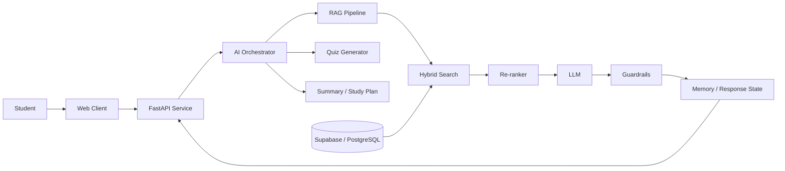

# Agentic RAG EDU — AI-Powered Study Platform

> An AI-native learning platform that turns study material into grounded tutoring, summaries, quizzes, and personalized study workflows.

[Live Demo](https://front-end-production-1b93.up.railway.app/) · [Omar Ahmed](https://github.com/omarbazooka)

## Why this project exists

Students often have notes, PDFs, and presentations spread across different places, while generic chatbots can answer without grounding their responses in the student's own material. This project is designed around a different idea: **retrieve first, reason over trusted context, then generate**.

The platform combines an AI tutoring experience with a production-oriented backend and an agentic orchestration layer.

## Core capabilities

- Chat with uploaded study material through a RAG pipeline.
- Generate structured summaries and quizzes from retrieved context.
- Create personalized study-plan workflows.
- Use **hybrid retrieval** to combine semantic and keyword-style search signals.
- Re-rank retrieved candidates before generation to improve context quality.
- Preserve useful conversational memory across the learning flow.
- Apply input/output guardrails around LLM interactions.
- Route tasks through an orchestrator that supports sequential and parallel execution.

## System architecture

## Engineering decisions

### Separate AI service

The AI layer is isolated behind **FastAPI** instead of being tightly coupled to the client. This keeps model orchestration, retrieval logic, and API contracts independently maintainable and easier to scale.

### Retrieval quality before prompt complexity

The RAG flow focuses on retrieval quality through hybrid search and re-ranking rather than relying on prompt engineering alone.

### Agentic orchestration

The workflow was planned as a hybrid DAG so independent tasks can execute in parallel while dependent steps remain sequential. The goal is to keep the system understandable while supporting more advanced agent workflows over time.

### Production-oriented concerns

The design explicitly considers API boundaries, database state, memory, guardrails, maintainability, and future observability rather than treating the LLM as a standalone feature.

## Tech stack

**AI / Retrieval**

`LangChain` · `LLMs` · `RAG` · `Hybrid Search` · `Re-ranking` · `Prompt Engineering` · `Agentic Workflows`

**Backend / Data**

`Python` · `FastAPI` · `Supabase` · `PostgreSQL` · `Vector Search`

**Frontend**

`React` · `TypeScript`

## What I focused on

My work centered on the AI architecture and workflow design: retrieval, orchestration, grounding, quiz/tutoring flows, memory, guardrails, and the separation of the AI backend from the application layer.

## Current direction

The platform is continuing to evolve toward stronger evaluation, observability, deployment workflows, and more production-grade AI engineering practices.

## Notes

This repository is part of a larger educational AI project. Some deployment/configuration details may change as the system is actively improved.
